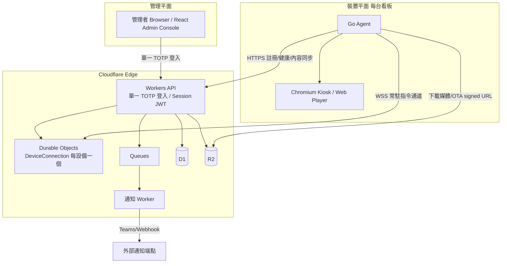

# ScreenBoard 電子看板平台 — 架構設計

> 本文件為系統架構設計（技術選型 / 架構圖 / 資料模型 / 元件拆分 / 協定），不含逐步實作。
>
> 逐步部署步驟請見 [deploy.md](deploy.md)。

## 背景與目標

建立一套可集中管理 Linux 電子看板設備的平台，涵蓋網頁看板播放、多媒體輪播、遠端管理、
OTA 更新、設備監控與多站點部署。

已定案的技術決策：

- **後端**：Cloudflare 全家桶（Workers + D1 + R2 + Durable Objects + Queues）
- **裝置 Agent**：Go（單一二進位、低占用、跨架構交叉編譯、OTA 好替換）
- **管理前端**：React + Vite + Tailwind（部署到 Cloudflare Pages / Workers Assets）
- **管理者登入**：單一 TOTP（RFC 6238），免帳號密碼
- **健康時序**：存於 D1（快照 + 歷史表），不使用 Analytics Engine
- **雲端 → 設備遠端存取**：標配（每台設備跑 cloudflared 建 Tunnel）
- **規模**：約數十台設備（無擴充壓力，設計可從簡）
- **裝置憑證**：每設備簽章 token（JWT）+ refresh + D1 撤銷清單，暫不用 mTLS

設計原則：裝置一律**主動向外連線**（outbound HTTPS/WSS）→ 不需公網 IP、不需 VPN，天然符合
「不開放 Public IP」。

---

## 技術選型總覽（功能 → Cloudflare 服務）

| 功能領域 | 對應服務 |
|---|---|
| API 後端 / 商業邏輯 | Cloudflare Workers |
| 關聯式資料（設備/清單/排程/使用者/媒體 metadata） | D1（SQLite） |
| 媒體 / 截圖 / OTA 套件 / 版本檔 儲存 | R2（S3 相容、無流量費） |
| 即時指令通道 + 在線狀態 | Durable Objects（每設備一個，WebSocket Hibernation） |
| 健康時序指標（CPU/Mem/Disk/Uptime） | D1（最近快照 + 歷史表，定期彙總並設保留期） |
| 非同步事件 / 通知投遞 | Queues + 通知 Worker |
| 管理者登入（單一 TOTP，免帳密） | 自建於 Workers（RFC 6238 TOTP）+ Session JWT |
| 遠端除錯存取設備（標配） | Cloudflare Tunnel（每設備 cloudflared） |
| 前端託管 | Cloudflare Pages / Workers Assets |
| 密鑰管理 | Workers Secrets / Secrets Store |

---

## 系統架構

三個平面：**管理平面**（管理者）、**裝置平面**（Go Agent + Chromium）、**內容/儲存平面**（R2/D1）。



連線模型重點：

- **管理者 → API**：單一 TOTP（RFC 6238）登入（免帳號密碼），Worker 簽發 Session JWT，後續請求以 JWT 驗證。
- **設備 → 雲端**：Agent 主動 outbound。健康/內容用 HTTPS；即時指令用單一常駐 WSS 連到該設備的
  Durable Object。**無 inbound、無公網 IP**。
- **雲端 → 設備**（標配）：每台設備標配 cloudflared 建立 Tunnel，供管理者遠端 SSH/VNC 除錯；
  存取經平台登入（TOTP Session）後授權的閘道轉送，設備仍不開公網 IP。

---

## Monorepo 結構（建議）

```
screenboard/
├─ apps/
│  ├─ api/         # Cloudflare Workers（REST API + DO + Queue consumer）
│  ├─ admin/       # React + Vite + Tailwind 管理後台
│  └─ player/      # 網頁播放器（靜態，Chromium kiosk 載入）
├─ agent/          # Go 裝置 Agent（含本地播放器 HTTP server、Chromium 控制、OTA、截圖）
├─ packages/
│  └─ shared/      # 共用型別 / 協定 schema（TS）；Agent 端另備 Go struct
├─ migrations/     # D1 schema 遷移
└─ wrangler.jsonc  # Workers/D1/R2/DO/Queues 綁定
```

---

## 元件拆分

1. **Admin Console（React + Vite + Tailwind）** — 設備樹狀分群、Playlist 編輯與排程、CMS 媒體庫、
   Dashboard、OTA 發布、告警與通知設定、使用者/角色。以單一 TOTP 登入保護。
2. **Workers API** — REST 端點 + RBAC 授權 + 內容解析（依時間/設備算出當前應播 Playlist）+
   R2 signed URL 簽發 + Queue 生產者。
3. **DeviceConnection（Durable Object，每設備一個）** — 持有該設備 WSS 連線（Hibernation）、
   追蹤 last-seen/在線狀態、以 Alarm 判定離線、下推指令並收 ack。
4. **通知 Worker（Queue consumer）** — 消費事件，投遞 Teams / Webhook，含重試。
5. **Player（網頁播放器）** — 由 Agent 的本地 HTTP server 提供；抓取已解析的 Playlist 與本地快取
   媒體，做輪播/轉場/循環，回報播放事件與錯誤（供黑屏/錯誤偵測）。
6. **Go Agent** — 首開機自動註冊、蒐集設備資訊與健康、常駐 WSS、控制 Chromium（--kiosk、zoom、
   rotate、多螢幕 via xrandr/wlr-randr）、定時/即時截圖、媒體/OTA 下載與快取、OTA 安裝與重啟。

---

## 資料模型（D1 主要資料表）

- `groups`：裝置分群（扁平、無巢狀、無類型），`id, name`。
- `devices`：`uuid, name, hostname, serial, os_version, agent_version, ip, mac, resolution,
  group_id, status(online/offline/warning/maintenance), last_seen_at, registered_at`。
- `enrollment_tokens`：`token, group_id, expires_at, used_by_uuid`（首開機註冊用）。
- `device_health_latest`：每設備最近一筆快照；`device_health_history` 存時序明細（定期彙總、設保留期以控表大小）。
- `playlists`：`id, name, loop, created_by, updated_at`。
- `playlist_items`：`id, playlist_id, type(url/image/video/pdf/html), source(url 或 media_id),
  duration_sec, order_index`。
- `schedules`：`id, playlist_id, target_type(device/group), target_id, date_start, date_end,
  time_start, time_end, weekdays_bitmask, priority`（多筆重疊時以 priority 決勝）。
- `media` / `media_versions` / `media_tags`：媒體 metadata、歷史版本（回滾）、標籤。
- `screenshots`：`id, device_id, r2_key, taken_at, trigger(auto/manual), analysis_result`。
- `ota_packages`：`id, channel(stable/beta), version, r2_key, checksum, signature, notes`。
- `ota_deployments`：`id, package_id, strategy(all/group/canary), target, percent, status`。
- `users`：`id, name, totp_secret(加密), role(admin/operator)`（免帳密，每個管理身分綁一組 TOTP）。
- `sessions`：`token_id, user_id, issued_at, expires_at`（Session JWT + 撤銷清單）。
- `commands`：指令稽核 `id, device_id, type, payload, status, issued_by, issued_at, ack_at`。
- `events`：告警/事件 `id, type, device_id, severity, message, created_at, resolved_at`。

---

## Agent ↔ Cloud 通訊協定

- **註冊**：`POST /api/enroll`（帶 enrollment token + 設備資訊）→ 回 `device_uuid` + **裝置 access token
  (JWT) + refresh token**。首開機自動執行，enrollment token 一次性。
- **健康回報**：定期 `POST /api/devices/{uuid}/health`（更新 D1 快照 + 寫入 D1 歷史表）。
- **內容同步**：`GET /api/devices/{uuid}/playlist` → 回「當下已解析」的清單（含 item 與 checksum）；
  Agent 比對本地快取，缺項用 R2 signed URL 下載。
- **即時指令**：`WSS /ws?device={uuid}`（連到該設備 DO，Hibernation）。下推 Reload / Switch Playlist /
  Reboot / Shutdown / Restart Player / Take Screenshot；Agent 回 ack。
- **截圖上傳**：向 API 換 R2 signed PUT URL → 上傳 → 回報 metadata。
- **OTA 查詢**：`GET /api/agent/update?channel=stable&current={ver}` → 有更新則回套件 URL + checksum + 簽章。

---

## 12 大功能 → 元件/服務對應

- **設備管理/分群**：`devices` + `groups` 樹；enrollment token 綁定 group。
- **Playlist / 排程**：`playlists`+`items`+`schedules`；API 端做時間解析（星期/時段/日期 + priority）。
- **Screen 控制**：顯示屬性（kiosk/zoom/rotate/多螢幕）存設備設定，由 Agent 落地到 Chromium/X11/Wayland；
  遠端操作（Reload/Reboot/…）走 DO WSS 指令。
- **健康檢查 / 在線狀態**：D1 時序（快照 + 歷史表）+ DO Alarm 判離線；Online/Offline/Warning/Maintenance 狀態機。
- **Screenshot**：定時（5/15 分或自訂）與即時；R2 儲存；黑屏/內容/瀏覽器錯誤偵測（Player 回報 +
  可選 Workers AI 影像判黑屏）。
- **OTA**：R2 套件 + `ota_packages`/`ota_deployments`；stable/beta 通道；下載→驗簽→安裝→重啟；
  全部/群組/灰度（canary %）。
- **CMS**：R2 媒體 + `media_versions` 版本/回滾 + `media_tags` 標籤。
- **使用者/權限**：單一 TOTP 登入（免帳密），`users.role` 做 RBAC（Admin/Operator/Viewer）於 Worker 強制。
- **系統監控 Dashboard**：彙總 D1（總數/在線/離線/告警數、播放次數、在線率、內容使用率）。
- **通知**：事件 → Queues → 通知 Worker → Teams（Incoming Webhook）/ 泛用 Webhook。
- **Cloudflare 整合**：Tunnel（標配遠端除錯）、R2（全儲存）。

---

## 安全模型

- **管理平面**：單一 TOTP（RFC 6238）登入（免帳密）→ Worker 簽發 Session JWT；每請求驗 JWT →
  查 `users.role` → RBAC。TOTP secret 加密存 D1，登入具頻率限制/鎖定防暴力破解。
- **裝置平面**：enrollment token（一次性、限時、綁 group）換發**每設備簽章 token（JWT，含 device UUID）**；
  每請求帶 `Authorization: Bearer`；access token 短效 + 自動 refresh，D1 保留撤銷清單以即時停用失竊/汰除設備。
- **OTA 完整性**：套件以私鑰 Ed25519 簽章，Agent 內嵌公鑰驗簽 + checksum，杜絕竄改。
- **媒體完整性**：以 checksum 驗證下載；R2 存取一律經 signed URL。
- **密鑰**：Workers Secrets / Secrets Store，不入庫、不入前端。

---

## 已定案假設與待決策項

已定案：

- **規模**：約數十台 → 無擴充壓力；DO 數量、D1 時序表、Queue 吞吐皆遠低於門檻，設計可從簡。
- **裝置憑證**：採**每設備簽章 token（JWT）**，含 access/refresh token 與 D1 撤銷清單；暫不用 mTLS。
  （token = 持有即可用、Workers 原生、易撤銷；mTLS 需自建 CA，數十台規模成本不划算，日後可再遷移。）
- **離線韌性**：本階段暫緩，不特別設計斷網續播與快取上限。

待決策：

- **多租戶**：目前假設單組織多站點；若日後需多客戶隔離，再於資料模型加 `tenant_id`。
- **健康時序保存期**：D1 歷史表保留天數與彙總粒度（數十台下資料量小，優先度低）。

---

## 架構驗證建議（垂直薄切片 POC）

以一條「垂直薄切片 POC」驗證核心路徑是否成立，再展開全功能：

1. Worker + D1 + 一個 `DeviceConnection` DO 起底；Go Agent 完成 enroll → 建立 WSS。
2. Admin 觸發一個指令（如 Take Screenshot / Reload）→ 經 DO 下推 → Agent ack → 截圖上 R2 → Admin 看到。
3. 建立一個含 URL + 圖片的 Playlist + 一筆排程 → Agent 拉到已解析清單 → Player 在 Chromium kiosk 輪播。
4. 驗證離線判定：關閉 Agent → DO Alarm 逾時 → 設備轉 Offline → 觸發 Queues → Teams/Webhook 收到告警。

此四步涵蓋「註冊 / 即時指令 / 內容播放 / 監控告警」四大主軸，證明 Cloudflare 全家桶 + Go Agent
的整體協定與資料流可行，即可作為後續全功能開發的骨架。
